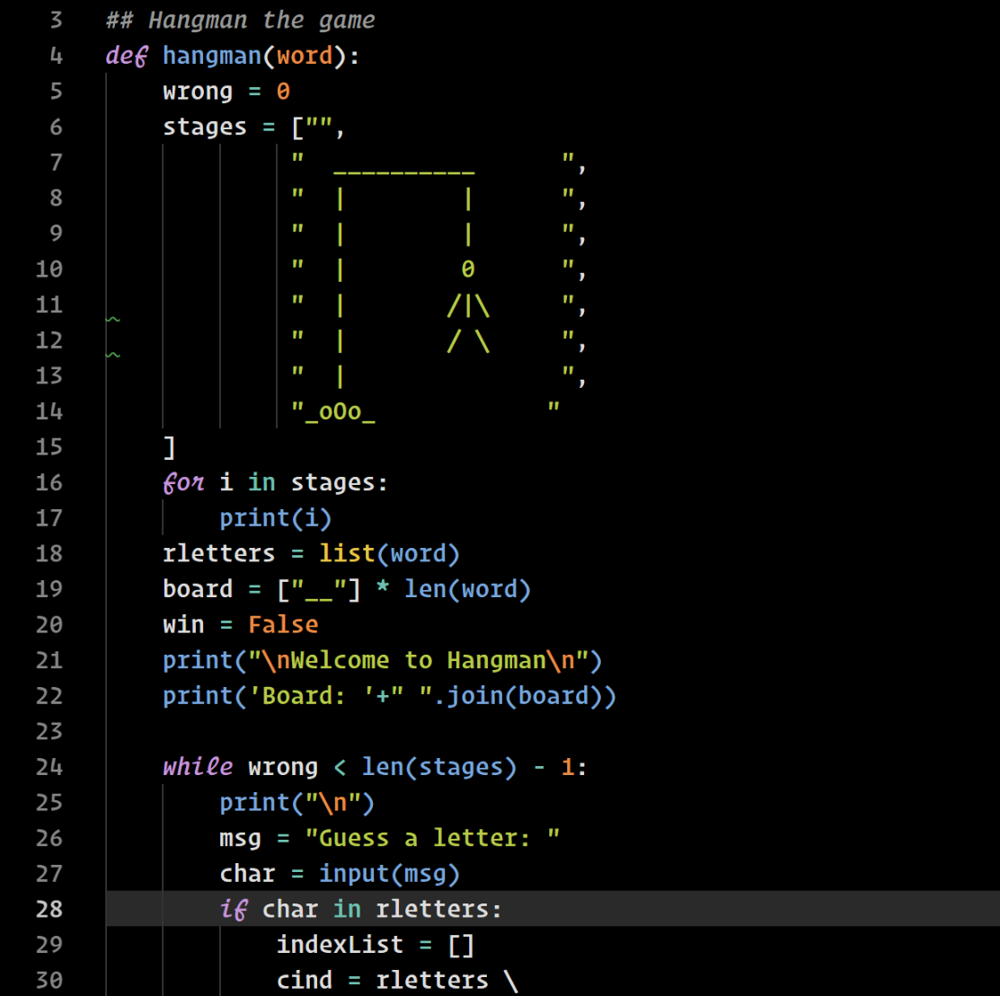
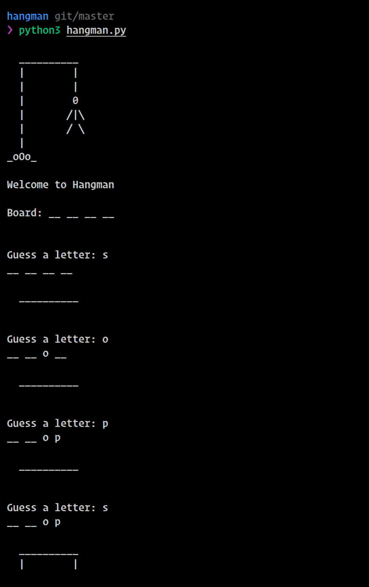

# hangman
Simple hangman game created in Python. The game entirely runs in the command line and asks for inputs via its user interface. 

The code was written entirely in python. A collection of words is stores in the wordsHangman.txt file
and the main program pulls data from it to create the game stage. Here is an example of the source code:

Here is an example of the game during execution. It will ask you for input until you are able to guess
the word or you have failed an enough number of times.

