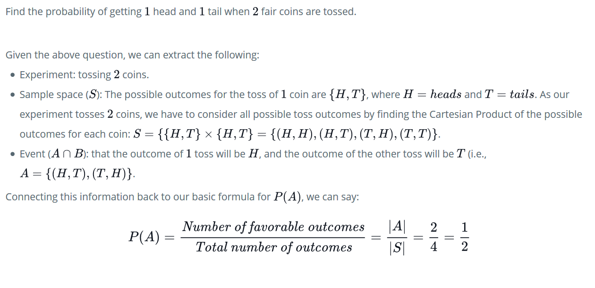
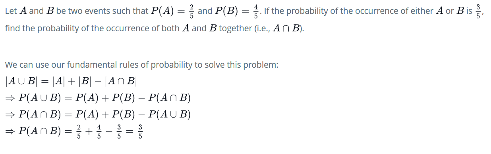
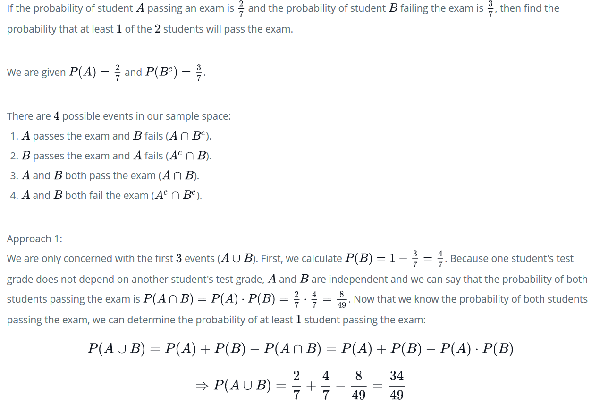
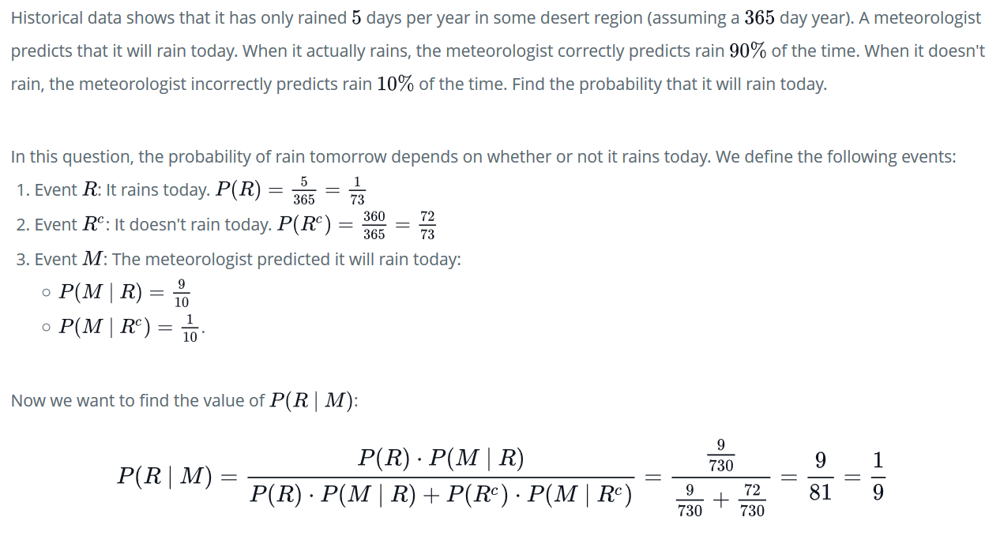
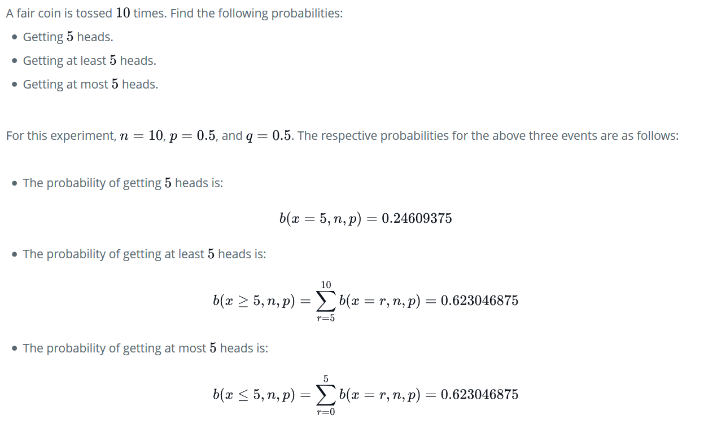
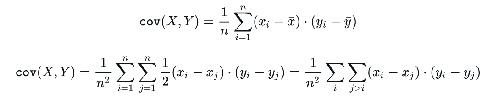
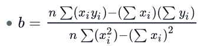
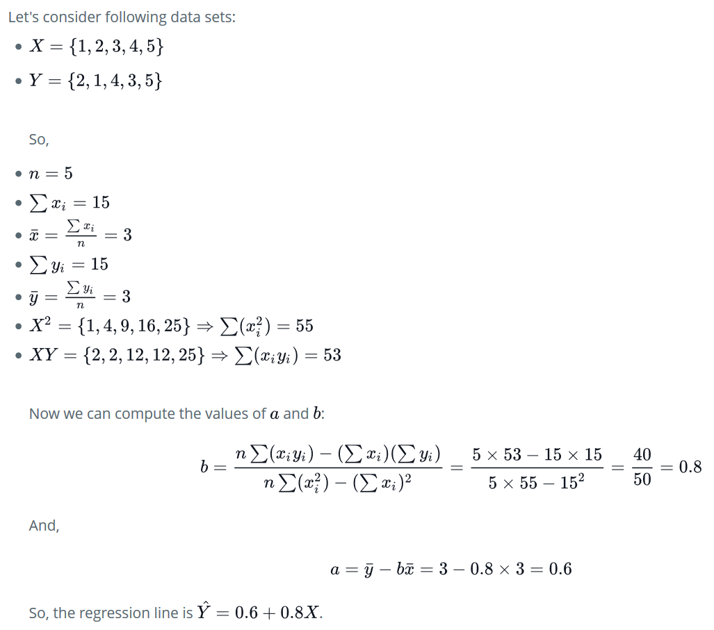

# 10 days of statistics

## Day 0: mean, median and modal

Link: [Mean, median and modal](https://www.hackerrank.com/challenges/s10-basic-statistics/tutorial).

### Mean (also called average, represented by the `mu` greek letter)

The average of all the integers in a set of values. Here is the basic formula for calculating the mean of a set of `n` values:
```
mu = sum(x_i from 1 to n)/n
```
Where `x_i` is the `i_th` element of the set.

### Median

The midpoint value of a data set for which an equal number of samples are less than and greater than the value. For an odd sample size, this is the middle element of the sorted sample; for an even sample size, this is the average of the `2` middle elements of the sorted sample.

### Mode

The element(s) that occur most frequently in a data set. For the set `{1,1,1,2,2,3,4,4}`, the mode is `1` because the number appears three times in the set and every other number in the set has a frequency `<3`. In contrast, the set `{1,2,3,4}` is multimodal because no number in the set appears more than `1` time, so every number in the set is a valid mode.

### Precision and Scale

These are important terms to understand when formatting your output:

- Precision refers to the number of significant digits in a number. For example, the numbers `123.45` and `0.0012345` both have a precision of `5`.
- Scale refers to the number of significant digits to the right of the decimal point. For example, the number `123.45` has a scale of `2` decimal places. This term is sometimes misrepresented as precision in documentation. 

### Setting precision in python

There are many ways to set precision of floating point value. Some of them is discussed below.
```python
# Python code to demonstrate precision 
# and round() 
  
# initializing value 
a = 3.4536
```

1. Using “%” :- “%” operator is used to format as well as set precision in python. This is similar to “printf” statement in C programming.
```python
# using "%" to print value till 2 decimal places  
print ("The value of number till 2 decimal place(using %) is : ",end="") 
print ('%.2f'%a) 
```

2. Using format() :- This is yet another way to format the string for setting precision.
```python
# using format() to print value till 2 decimal places  
print ("The value of number till 2 decimal place(using format()) is : ",end="") 
print ("{0:.2f}".format(a)) 
```

3. Using round(x,n) :- This function takes 2 arguments, number and the number till which we want decimal part rounded.
```python
# using round() to print value till 2 decimal places  
print ("The value of number till 2 decimal place(using round()) is : ",end="") 
print (round(a,2)) 
```

## Day 1: Quartiles

Link: [Quartiles](https://www.hackerrank.com/challenges/s10-quartiles/tutorial).

### Quartile

The quartiles of an ordered data set are the `3` points that split the data set into `4` equal groups. The `3` quartiles are defined as follows:

    1. `Q_1` The first quartile is the middle number between the smallest number in a data set an its median.
    2. `Q_2` The second quartile is the median (`50_th` percentile) of the data set.

    3. `Q_3` The third quartile is the middle number between a data set's median and its largest number.

#### Computing the First and Third Quartile

We will use the first method described in the Wikipedia:

We will split the data into two halves, lower half and upper half:

    - If there are an odd number of data points in the original ordered data set, do not include the median (the central value in the ordered list) in either half.

    - If there are an even number of data points in the original ordered data set, split this data set exactly in half.

The value of the first quartile (`Q_1`) is the median of the lower half and the value of the third quartile (`Q_3`) is the median of the upper half.

#### Example 1

We will consider the following ordered dataset for this example:
```python
    6, 7, 15, 36, 39, 40, 41, 42, 43, 47, 49
```
The median of the dataset is `40`. As there are an odd number of data points, we do not include the median (the central value in the ordered list) in either half:
```python
    Lower half: 6, 7, 15, 36, 39

    Upper half: 41, 42, 43, 47, 49
```
The median of the lower half is `15`, so the value of the first quartile is `15`, and the median of the upper half is `43`, so the value of the third quartile is `43`.

#### Example 2

We will consider the following ordered dataset for this example:
```python
    7, 15, 36, 39, 40, 41
```
As there are an even number of data points in the original ordered data set, we will split this data set exactly in half:
```python
    Lower half: 7, 15, 36

    Upper half: 39, 40, 41
```
The median of the lower half is `15`, so the value of the first quartile is `15`, and the median of the upper half is `40`, so the value of the third quartile is `40`.

Here is the link supporting the following topics: [Expected value, variance and standard deviation](https://www.hackerrank.com/challenges/s10-standard-deviation/tutorial)

### Expected Values


The expected value of a discrete random variable, `X`, is more or less another way of referring to the mean (`mu`). We can also refer to this as the mathematical expectation (or just the expectation) of `X`.

### Variance `sigma^2`

This is the average magnitude of fluctuations of `X` from its expected value, `mu`. You can also think of it as the expectation of a random variable's squared deviation from its mean. Given a data set, `X` , of size `n`:
```python
    sigma^2 = sum((x_i-mu)**2 for i from 1 to n)/n
```

where `x_i` is the `i_th` element of the data set and is the mean of all the elements.

### Standard Deviation `sigma`

The standard deviation quantifies the amount of variation in a set of data values. Given a data set, `X`, of size `n`:
```python
    sigma = sqrt ( sum( (x_i-mu)**2 for i from 1 to n )/n )
```
where `x_i` is the `i_th` element of the data set and `mu` is the mean of all the elements. 

## Day 3: The basics of probabilities

### Event, Sample Space, and Probability

In probability theory, an experiment is any procedure that can be infinitely repeated and has a well-defined set of possible outcomes, known as the sample space, `S`. We define an event to be a set of outcomes of an experiment (also known as a subset of `S`) to which a probability (numerical value) is assigned.

The probability of the occurrence of an event, `A`, is:
```python
    P(A) = number_of_favorable_outcomes / total_number_of_outcomes
```

Here are the first two fundamental rules of probability:

    1. Any probability, `P(A)`, is a number between `0` and `1` (i.e.,`0 <= P(A) <= 1`).
    2. The probability of the sample space, `S`, is `1` (i.e.,`P(S) = 1`).

So how do we bridge the gap between the value of `P(A)`and the sample space? Quite simply, since we know that `P(A)` is the probability that event `A` will occur, then we define `P(A_c)`(also written as `P(A')`) to be the probability that event `A` will not occur (the complement of `P(A)`). If our sample space is composed of the probabilities of `A`'s occurrence and non-occurrence, we can then say `P(A) + P(A_c) = 1`, or the sum of all possible outcomes of `A` in the sample space is equal to `1`. This is the third fundamental rule of probability: 

    3. `P(A_c) = 1 - P(A)`.

#### Example 1

Find the probability of getting an odd number when rolling a `6`-sided fair die.

Given the above question, we can extract the following:

    - Experiment: rolling a `6`-sided die.
    - Sample space (`S`): `S = {1,2,3,4,5,6}`.
    - Event (`A`): that the number rolled is odd (i.e., `A = {1,3,5}`).

If we refer back to the basic formula for the probability of the occurrence of an event, we can say: 
```python
    P(A) = number_of_favorable_outcomes / total_number_of_outcomes

    P(A) = |A|/|S| = 3/6 = 1/2
```

## Compound Events, Mutually Exclusive Events, and Collectively Exhaustive Events

Let's consider `2` events: `A` and `B`. A compound event is a combination of `2` or more simple events. If `A` and `B` are simple events, then `A u B` denotes the occurrence of either `A` or `B`. Similarly, `A n B` denotes the occurrence of `A` and `B` together.

`A` and `B` are said to be mutually exclusive or disjoint if they have no events in common (i.e., `A n B = O` and `P(A n B) = 0`). The probability of any of `2` or more events occurring is the union (`u`) of events. Because disjoint probabilities have no common events, the probability of the union of disjoint events is the sum of the events' individual probabilities. `A` and `B` are said to be collectively exhaustive if their union covers all events in the sample space (i.e., `A u B = S` and `P (A u B) = 1`). This brings us to our next fundamental rule of probability: if `2` events, `A` and `B`, are disjoint, then the probability of either event is the sum of the probabilities of the `2` events (i.e.,`P (A or B) = P(A) + P(B)`).

If the outcome of the first event (`A`) has no impact on the second event (`B`), then they are considered to be independent (e.g., tossing a fair coin). This brings us to the next fundamental rule of probability: the multiplication rule. It states that if two events,`A` and `B`, are independent, then the probability of both events is the product of the probabilities for each event (i.e., `P(A and B) = P(A)*P(B)`). The chance of all events occurring in a sequence of events is called the intersection (`n`) of those events.

### Example 1


### Example 2



## Day 3

### Conditional Probability

This is defined as the probability of an event occurring, assuming that one or more other events have already occurred. Two events, `A` and `B` are considered to be independent if event `A` has no effect on the probability of event (i.e. `P(B|A) = P(B)`). If events `A` and `B` are not independent, then we must consider the probability that both events occur. This can be referred to as the intersection of events `A` and `B`, defined as `P (A n B) = P( B | A) * P (A)`. We can then use this definition to find the conditional probability by dividing the probability of the intersection of the two events (`A n B`) by the probability of the event that is assumed to have already occurred (event `A`):
```python
P (B | A) = P (A n B)/ P(A)
```

#### Example 1



### Bayes rule

Let `A` and `B` be two events such that `P (A | B)` denotes the probability of the occurrence of `A` given that `B` has occurred and `P (B | A)` denotes the probability of `B` the occurrence of given that `A` has occurred, then:

```python
P (A | B) = P (B | A) * P (A)/ P(B) = P ( B | A) * P (A) / ( P (B | A)*P(A) +P (B | A_c) * P(A_c))
```

#### Example 2


As you may have already noticed, finding patterns in the possible ways events can occur is very useful in helping us count the number of desirable events in our sample space. Two of the easiest methods for doing this are with permutations (when order matters) and combinations (when order doesn't matter). 

### Permutations

An ordered arrangement of `r` objects from a set,`A` , of `n` objects (where `0 < r <= n`) is called an `r`-element permutation of `A`. You can also think of this as a permutation of `A`'s elements taken `r` at a time. The number of `r`-element permutations of an `n`-object set is denoted by the following formula:

```python
    n_P_r = n! /(n-r)!
```

**Note**: We define `0!` to be `1`; Otherwise, `n_P_n` would be `n!/0` (when `r = n`).

### Combinations

An unordered arrangement of `r` objects from a set, `A`, of `n` objects (where `r <= n`) is called an `r`-element combination of `A`. You can also think of this as a combination of `A`'s elements taken `r` at a time.

Because the only difference between permutations and combinations is that combinations are unordered, we can easily find the number of `r`-element combinations by dividing out the permutations (`r!`):

```python
n_C_r = n_P_r / r! = n! (r! *(n-r)!)
```

When we talk about combinations, we're talking about the number of subsets of size `r` that can be made from a set of size `n`. In fact, `n_C_r` is often referred to as "`n` choose `r`", because it's counting the number of `r`-element combinations that can be chosen from a set of `n` elements. In notation, `n_C_r` is typically written as `(n r)`. 

## Day 4

### Random Variable

A random variable, `X`, is the real-valued function `X : S -> R` in which there is an event for each interval `I` where `I C= R` . You can think of it as the set of probabilities for the possible outcomes of a sample space. For example, if you consider the possible sums for the values rolled by `2` four-sided dice:


**Note**: When we roll two dice, the value rolled by each die is independent of the other.

### Binomial experiment

A binomial experiment (or Bernoulli trial) is a statistical experiment that has the following properties:

- The experiment consists of `n` repeated trials.
- The trials are independent.
- The outcome of each trial is either success (`s`) or failure (`f`).

### Bernoulli Random Variable and Distribution

The sample space of a binomial experiment only contains two points, `s` and  `f`. We define a Bernoulli random variable to be the random variable defined by `X ( s ) = 1` and `X(f) = 0`. If we consider the probability of success to be `p` and the probability of failure to be `q` (where `q = 1 - p`), then the probability mass function (PMF) of `X` is:

```python
    p(x):
        1 - p = q if x = 0
        p         if x = 1
        0         otherwise
```
We can also express this as:

```python
    f(x) = (p^x)*((1-p)^(1-x)), for x E {0,1}
```

### Binomial Distribution

We define a binomial process to be a binomial experiment meeting the following conditions:

-   The number of successes is `x`.
-   The total number of trials is `n`.
-   The probability of success of `1` trial is `p`.
-   The probability of failure of `1` trial `q`, where `q = 1 - p`.
- `b(x , n , p)` is the binomial probability, meaning the probability of having exactly `x` successes out of `n` trials.

The binomial random variable is the number of successes, `x`, out of `n` trials.

The binomial distribution is the probability distribution for the binomial random variable, given by the following probability mass function:

```python
    b(x,n,p) = [n x] * (p^x) * q^(n-x)
```

Note: Recall that `[n x] = n!/(x!*(n-x)!)`. For further review, see the Combinations and Permutations Tutorial. 

### Cumulative Probability

We consider the distribution function for some real-valued random variable, `X`, to be  `F_X(x) = P(X <= x)`. Because this is a non-decreasing function that accumulates all the probabilities for the values of `X` up to (and including) `x`, we call it the cumulative distribution function (CDF) of `X`. As the CDF expresses a cumulative range of values, we can use the following formula to find the cumulative probabilities for all `x E [a,b]`:

```python
    P (a < X <= b) = F_X(b) - F_X(a)
```

#### Example



### Geometric distribution

See [here](https://www.hackerrank.com/challenges/s10-geometric-distribution-1/tutorial).


## Day 5

### Poisson distribution 

See [here](https://www.hackerrank.com/challenges/s10-poisson-distribution-1/tutorial).

### Normal distribution

See [here](https://www.hackerrank.com/challenges/s10-normal-distribution-1/tutorial).

## Day 6

### Central limit theorem 

The central limit theorem (CLT) states that, for a large enough sample (`n`), the distribution of the sample mean will approach normal distribution. This holds for a sample of independent random variables from any distribution with a finite standard deviation.

Let `{X_1,X_2,X_3,...,X_n}` be a random data set of size `n`, that is, a sequence of independent and identically distributed random variables drawn from distributions of expected values given by `u` and finite variances given by `sigma_squared`. The sample average is:
```python
    s_n := sum(X_i for i in range(N))/N
```


For large `n`, the distribution of sample sums `S_n` is close to normal distribution `N(u',sigma')` where:

    - `u' = n * u`
    - `sigma' = sqrt(n)*sigma`

## Day 7

### Covariance

This is a measure of how two random variables change together, or the strength of their correlation.

Consider two random variables, `X` and `Y`, each with `n` values (i.e.,`x_1`, `x_2`,..., `x_n` and `y_1`, `y_2`,...,`y_n` ). The covariance of `X` and `Y` can be found using either of the following equivalent formulas: 



Here, `x_mean` is the mean of `X` and `y_mean` is the mean of Y. 

### Pearson correlaction coefficient

The Pearson correlation coefficient, `rho_x_y`, is given by:
```python
    rho_x_y =  cov(X,Y)/(x_sigma*y_sigma)
```
Here, `x_sigma` is the standard deviation of `X` and `y_sigma` is the standard deviation of `Y`. You may also see `rho_x_y` written as `r_x_y`. 

### Spearman rank correlation coefficient

We have two random variables, `X` and `Y`:

    - `X = {x_1, x_2, x_3,...,x_n}`
    - `Y = {y_1, y_2, y_3,...,y_n}`

If `Rank_x` and `Rank_y` denote the respective ranks of each data point, then the Spearman's rank correlation coefficient, `r_s` , is the Pearson correlation coefficient of `Rank_x` and `Rank_y`.

#### Example


## Day 8

### Regression line

If our data shows a linear relationship between `X` and `Y`, then the straight line which best describes the relationship is the regression line. The regression line is given by `Y_hat = a + bX`. 

### Finding the value of `b`

The value of `b` can be calculated using either of the following formulae:



Alternatively, 
```python
    b = rho * std_dev_Y/ std_dev_X
```
where `rho` is the Pearson correlation coefficient,`std_dev_X` is the standard deviation of `X` and `std_dev_Y` is the standard deviation of `Y`.

### Finding the value of `a`

`a = y_mean - b * x_mean`, where `x_mean` is the mean of `X` and `y_mean` is the mean of `Y`.

### Sums of squares

- Total sums of squares: SST = sum((y_i - y_mean)**2)
- Regresion sums of squares: SSR = sum((y_hat_i - y_mean)**2)
- Error sums of squares: SSE = sum((y_hat_i - y_i)**2)

If SSE is small, we can assume that our fit is good.

### Coefficient of determinantion (R-squared)

```python
R**2 = SSR / SST = 1 - SSE / SST
```

`R**2` multiplied by `100` gives the percent of variation attributed to the linear regression between `Y` and `X`.

### Example of linear regression



### Linear regression in Python

We can use the fit function in the sklearn.linear_model.LinearRegression class.

```python
from sklearn import linear_model
import numpy as np
xl = [1, 2, 3, 4, 5]
x = np.asarray(xl).reshape(-1, 1)
y = [2, 1, 4, 3, 5]
lm = linear_model.LinearRegression()
lm.fit(x, y)
print(lm.intercept_)
print(lm.coef_[0])
```

Running the above code produces the following output:

```python
0.6
0.8
```

## Day 9 

### Multiple linear regression

Here is the tutorial in which the analytic matrix solution is presented:

[Matrix solution multivariable linear regression](https://www.hackerrank.com/challenges/s10-multiple-linear-regression/tutorial)

#### Python implementation 

```python
from sklearn import linear_model
x = [[5, 7], [6, 6], [7, 4], [8, 5], [9, 6]]
y = [10, 20, 60, 40, 50]
lm = linear_model.LinearRegression()
lm.fit(x, y)
a = lm.intercept_
b = lm.coef_
print a, b[0], b[1]
```

Running the previous process produces the following output:

```python
51.9534883721 6.6511627907 -11.1627906977
```